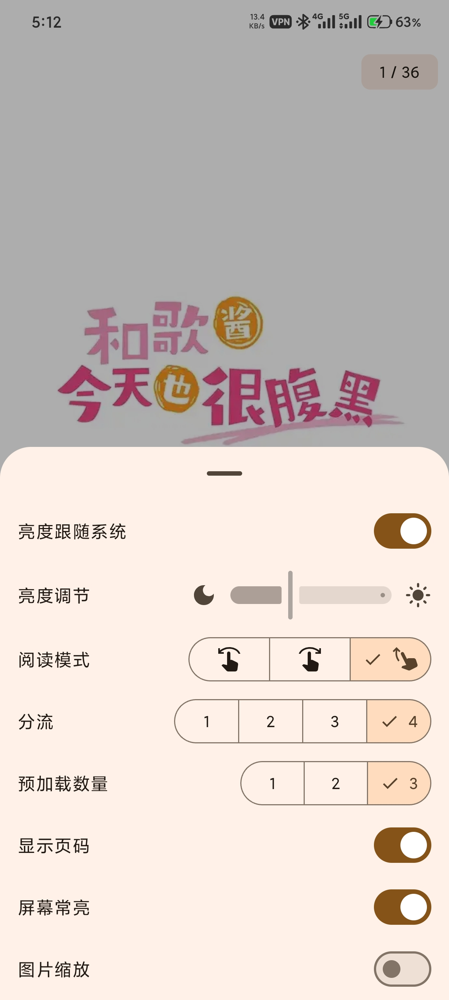

# v1.2.0（待发布）

- 阅读页底部新增设置弹层，可以在阅读过程中设置，在设置页中去除了相关的阅读页设置
  
- 阅读页底部进度条现在会自动隐藏
- 阅读页弹层设置包含：亮度跟随系统，亮度控制，阅读模式切换，分流切换，预加载数量切换，显示页码，屏幕常亮，图片缩放。
- 添加了额外的阅读模式，现在包含三种，左到右翻页，右到左翻页，滚动
- 阅读页添加了重试 UI ，包括获取图片列表失败，或者图片解码错误
- 统一了大多数列表在首次加载时的 Loading 效果
- 大多数带过滤项的列表页在切换过滤项后列表会自动滚动到顶部
- 调整了相关本子页面、本子章节页面取数据的逻辑
- 调整了搜索页跳转到搜索结果页或者本子详情页的逻辑，以前是搜索页->搜索结果页（接口如果是数字搜索）->本子详情页，现在改为 本子详情页<-搜索页（提前调取一次接口）->搜索结果页
- 调整了登录页的输入逻辑，现在会在失焦时自动去除首尾空格
- 修复了阅读页点击屏幕进行左右翻页无效问题
- 更新了一些依赖

# v1.1.0

- 进入搜索页自动聚焦输入框弹出输入法
- 支持设置线路和预载数量
- 支持滚动模式和翻页模式
- 支持查看某个本子的相关本子
- 为大多数页面添加了错误重试 UI

- 修复了图片未缓存问题
- 修复个人中心页无法下拉刷新问题
- 修复了一些样式错误

# v1.0.0

一个基本能用的版本，实现了以下功能

- [x] 登录
- [x] 搜索
- [x] 阅读
- [x] 收藏
- [x] 简易用户信息
- [x] 阅读历史
- [x] 漫画详情
- [x] 历史评论
- [x] 漫画评论
- [x] 发表评论
- [x] 首页推荐
- [x] 目录阅读
- [x] 日夜间模式
- [x] 每周必看
- [x] 自动登录

可能会有意想不到的 bug 😫😫，但大部分功能基本可用😘。

支持 android12 以上设备，建议开启梯子进行🛫。