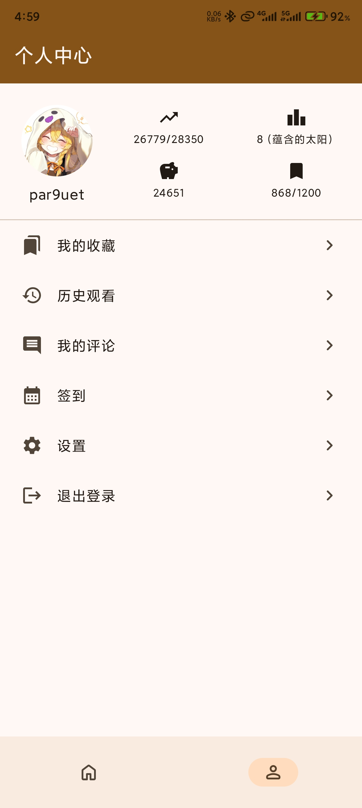
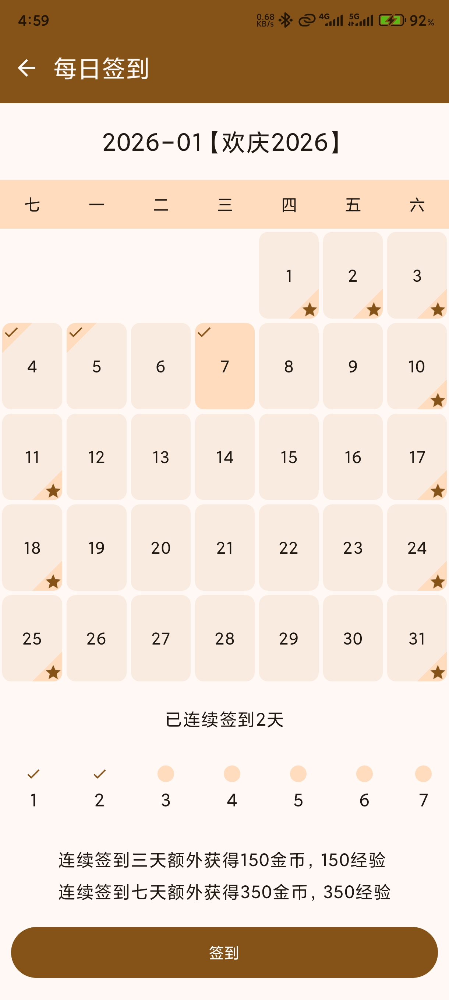
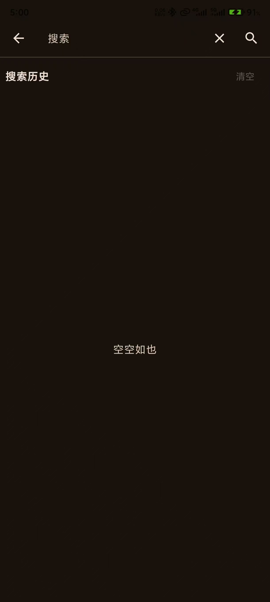
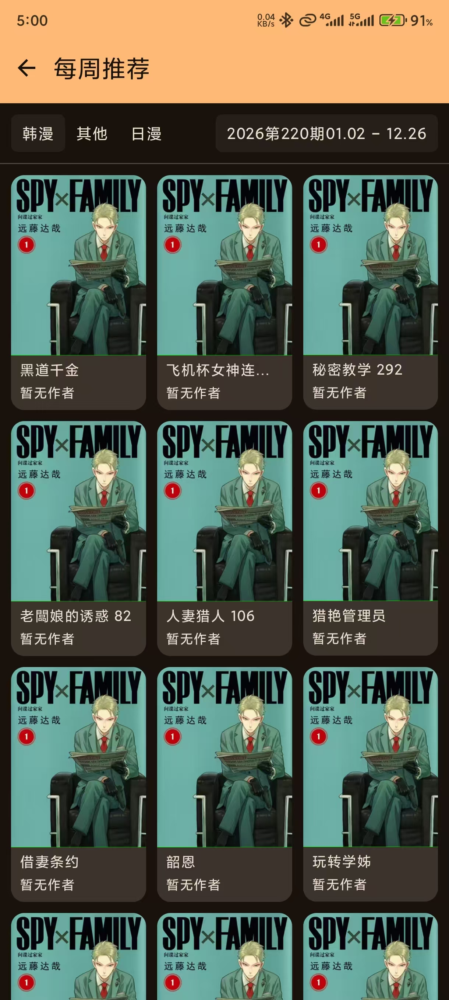

# jm-mobile

这是一个禁漫的第三方安卓客户端，基于 Android Compose 构建。

## NSFW 警告⚠

本软件可能存在裸露、暴力、色情或冒犯等不适宜公众场合的内容，请勿在公共场合使用本软件，避免不必要的纷争。

## 功能

- [x] 登录
- [x] 搜索
- [x] 阅读
- [x] 收藏
- [x] 简易用户信息
- [x] 阅读历史
- [x] 漫画详情
- [x] 历史评论
- [x] 漫画评论
- [x] 发表评论
- [x] 首页推荐
- [x] 目录阅读
- [x] 日夜间模式
- [x] 每周必看
- [x] 自动登录
- [ ] 相关漫画
- [ ] 漫画下载
- [ ] 漫画分类搜索
- [ ] 图片分流

## 截图

由于需要截图原因，封面图片已全部替换为《间谍过家家》封面。

### 首页

### 个人中心

### 签到

### 详情（日间模式）

### 详情（夜间模式）

### 搜索

### 每周必看

## 声明

本软件仅用于教育、学习和研究目的，旨在帮助开发者和用户理解应用程序的工作原理。作者与原始应用程序的开发者、公司或组织无关。所有涉及的代码或技术分析均为个人研究成果，并未用于商业用途或恶意活动。请勿将本软件用于任何违反法律或侵犯原开发者权利的活动。作者不对他人使用本软件产生的任何法律或财务后果承担责任。请在 24 小时内删除本软件。

## 安装包

点击[这里](https://github.com/Dedicatus546/jm-mobile/releases)或者右侧的 Release 处下载最新的版本。

## 致谢

本项目参考了以下项目的界面实现，在此表示衷心地感谢！

- [PiliPlus](https://github.com/bggRGjQaUbCoE/PiliPlus)
- [v2rayNG](https://github.com/2dust/v2rayNG)

---

如果你喜欢该软件，动动小手点个 star 就是对我最大的鼓励和帮助🙇‍！